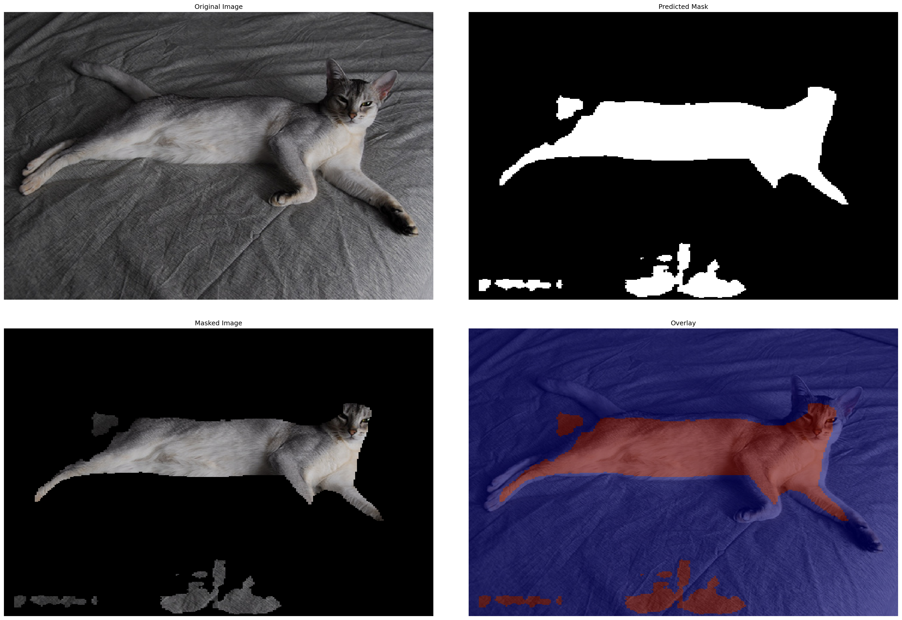
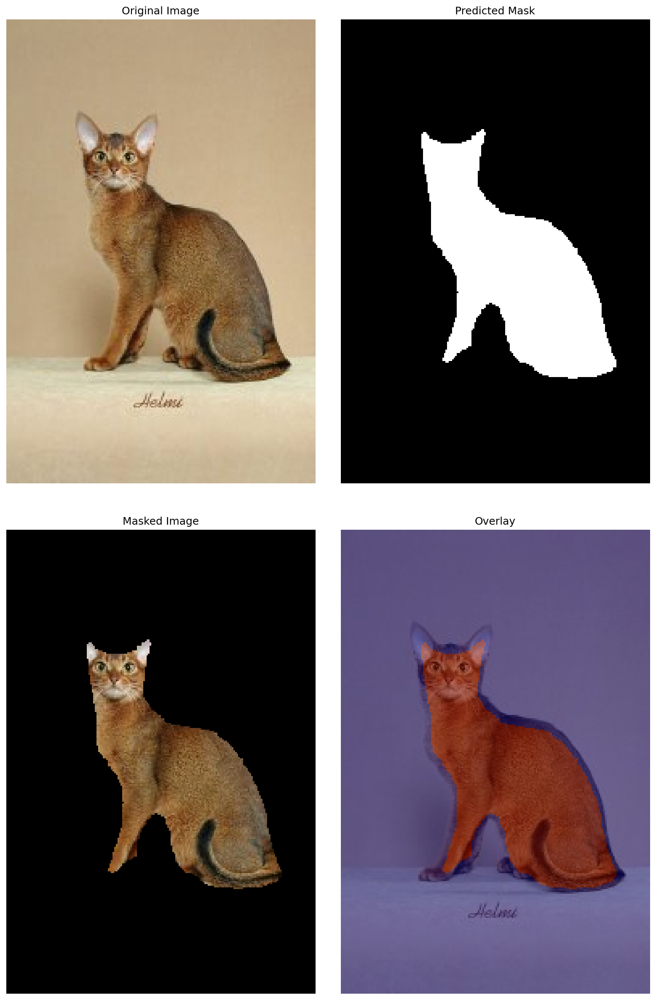
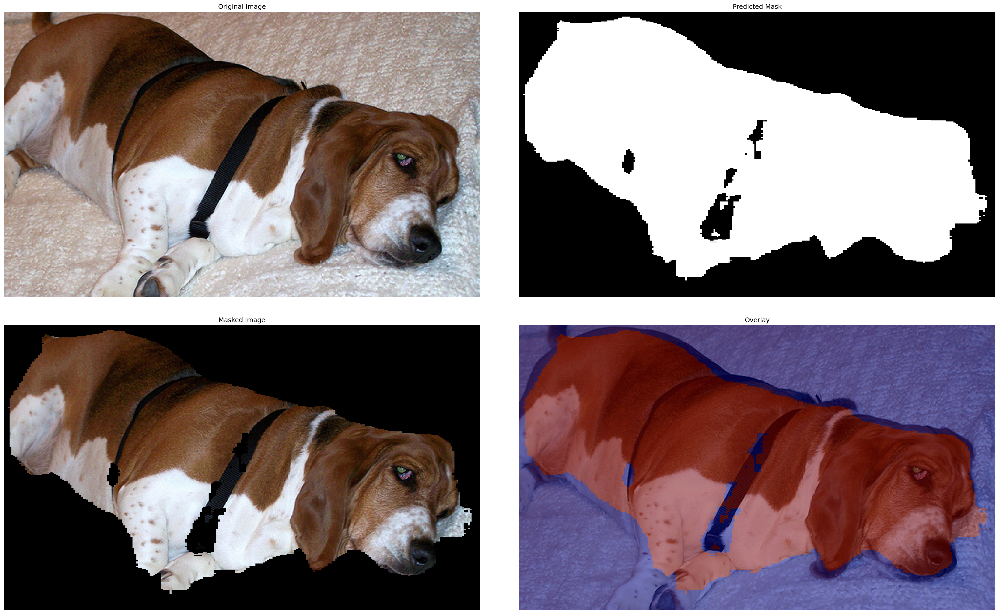
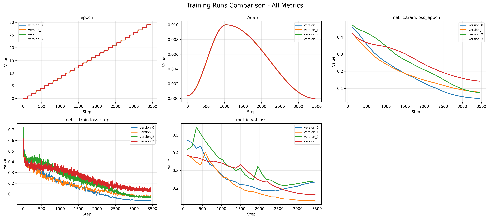

# U-Net Segmentation Experiments on Oxford-IIIT Pet Dataset

[](https://huggingface.co/spaces/firekind/era4-session-15)

This project implements and compares four different U-Net architectures for pet segmentation on the Oxford-IIIT Pet Dataset.

## Dataset

**Oxford-IIIT Pet Dataset**
- 37 pet categories (cats and dogs)
- ~3,680 training images (trainval split)
- ~3,669 test images
- Pixel-level trimap segmentation annotations
- Task: Binary segmentation (foreground pet vs background)

## Experiments Overview

Four U-Net variants were trained with different downsampling/upsampling strategies and loss functions:

1. **Max Pooling + Transpose Convolutions + BCE Loss**
2. **Max Pooling + Transpose Convolutions + Dice Loss**
3. **Strided Convolutions + Transpose Convolutions + BCE Loss**
4. **Strided Convolutions + Bilinear Upsampling + Dice Loss**

---

## Experiment 1: Max Pooling + Transpose Conv + BCE

### Description
- **Downsampling:** Max pooling (2×2, stride 2)
- **Upsampling:** Transpose convolutions (2×2, stride 2)
- **Loss Function:** Binary Cross-Entropy with Logits (BCEWithLogitsLoss)
- **Architecture:** Traditional U-Net architecture closest to the original paper

This is the baseline configuration using the most common U-Net components.

### Training Configuration

| Parameter | Value |
|-----------|-------|
| Loss | BCEWithLogitsLoss |
| Learning Rate | 0.01 (max_lr for OneCycleLR) |
| Batch Size | 32 |
| Epochs | 30 |
| Optimizer | Adam |
| LR Schedule | OneCycleLR (pct_start=0.3, div_factor=25) |
| Image Size | 256×256 |

The exact config used can be found [here](./scripts/version_0.yaml).

### Training Logs

Training logs can be found [here](./assets/version_0_stdout.txt).

### Example Outputs


## Experiment 2: Max Pooling + Transpose Conv + Dice Loss

### Description
- **Downsampling:** Max pooling (2×2, stride 2)
- **Upsampling:** Transpose convolutions (2×2, stride 2)
- **Loss Function:** Dice Loss
- **Architecture:** Same as Experiment 1, but with Dice loss

Dice loss is commonly used for segmentation as it directly optimizes the IoU metric and handles class imbalance better than BCE.

### Training Configuration

| Parameter | Value |
|-----------|-------|
| Loss | DiceLoss |
| Learning Rate | 0.01 (max_lr for OneCycleLR) |
| Batch Size | 32 |
| Epochs | 30 |
| Optimizer | Adam |
| LR Schedule | OneCycleLR (pct_start=0.3, div_factor=25) |
| Image Size | 256×256 |

The exact config used can be found [here](./scripts/version_1.yaml).

### Training Logs

Training logs can be found [here](./assets/version_1_stdout.txt).

### Example Outputs


## Experiment 3: Strided Conv + Transpose Conv + BCE

### Description
- **Downsampling:** Strided convolutions (2×2, stride 2)
- **Upsampling:** Transpose convolutions (2×2, stride 2)
- **Loss Function:** Binary Cross-Entropy with Logits
- **Architecture:** Replaces max pooling with learnable strided convolutions

Strided convolutions are learnable, potentially capturing better features during downsampling compared to fixed max pooling.

### Training Configuration

| Parameter | Value |
|-----------|-------|
| Loss | BCEWithLogitsLoss |
| Learning Rate | 0.01 (max_lr for OneCycleLR) |
| Batch Size | 32 |
| Epochs | 30 |
| Optimizer | Adam |
| LR Schedule | OneCycleLR (pct_start=0.3, div_factor=25) |
| Image Size | 256×256 |

The exact config used can be found [here](./scripts/version_2.yaml).

### Training Logs

Training logs can be found [here](./assets/version_2_stdout.txt).

### Example Outputs


## Experiment 4: Strided Conv + Bilinear Upsample + Dice Loss

### Description
- **Downsampling:** Strided convolutions (2×2, stride 2)
- **Upsampling:** Bilinear interpolation + 1×1 convolution
- **Loss Function:** Dice Loss (smooth=1.0)
- **Architecture:** Fully learnable downsampling with deterministic upsampling

Uses bilinear interpolation instead of transpose convolutions, which can reduce checkerboard artifacts.

### Training Configuration

| Parameter | Value |
|-----------|-------|
| Loss | DiceLoss (smooth=1.0) |
| Learning Rate | 0.01 (max_lr for OneCycleLR) |
| Batch Size | 32 |
| Epochs | 30 |
| Optimizer | Adam |
| LR Schedule | OneCycleLR (pct_start=0.3, div_factor=25) |
| Image Size | 256×256 |

The exact config used can be found [here](./scripts/version_3.yaml).

### Training Logs

Training logs can be found [here](./assets/version_3_stdout.txt).

### Example Outputs


## Comparative Results

### Training Metrics Comparison


### Summary Table

| Experiment | Downsampling | Upsampling | Loss | Best Val Loss |
|------------|-------------|------------|------|----------------|
| 1 | Max Pool | Transpose Conv | BCE | 0.1736 |
| 2 | Max Pool | Transpose Conv | Dice | 0.1277 |
| 3 | Strided Conv | Transpose Conv | BCE | 0.2018 |
| 4 | Strided Conv | Bilinear Upsample | Dice |0.1608 |

## Usage

### Training
```bash
# Experiment 1
python scripts/train.py fit --config configs/version_0.yaml

# Experiment 2
python scripts/train.py fit --config configs/version_1.yaml

# Experiment 3
python scripts/train.py fit --config configs/version_2.yaml

# Experiment 4
python scripts/train.py fit --config configs/version_3.yaml
```

### Inference
```bash
python scripts/infer.py \
    --checkpoint path/to/checkpoint.ckpt \
    --images image1.jpg image2.jpg \
    --output-dir predictions/
```
