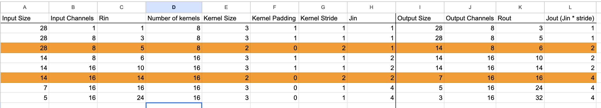

# Session 5 Assignment

Alright, so the goal was to build a CNN that doesn't suck at recognizing handwritten digits. Here's what I managed to pull off:

- ✅ **99.4%+ test accuracy** → Got **99.44%** (nailed it!)
- ✅ **Less than 20K parameters** → Only used **8,070 parameters** (way under!)
- ✅ **Less than 20 epochs** → Done in **15 epochs**
- ✅ **Batch Normalization** → Yep, used it
- ✅ **Dropout** → Added it everywhere
- ✅ **Global Average Pooling** → No giant FC layers needed

**[View the full notebook here](./notebooks/notebook.ipynb)**

## The Model (that actually worked)

Here's the architecture I ended up with after multiple attempts:

```
Input (28x28) → Block1 → Block2 → Block3 → Output (10 classes)

Block1: 8 channels, maxpool, dropout
Block2: 16 channels, maxpool, dropout  
Block3: 16→10 channels, GAP, dropout
```

### Full Architecture Details
```
----------------------------------------------------------------
        Layer (type)               Output Shape         Param #
================================================================
            Conv2d-1            [-1, 8, 28, 28]              80
              ReLU-2            [-1, 8, 28, 28]               0
       BatchNorm2d-3            [-1, 8, 28, 28]              16
            Conv2d-4            [-1, 8, 28, 28]             584
              ReLU-5            [-1, 8, 28, 28]               0
       BatchNorm2d-6            [-1, 8, 28, 28]              16
         MaxPool2d-7            [-1, 8, 14, 14]               0
           Dropout-8            [-1, 8, 14, 14]               0
            Conv2d-9           [-1, 16, 14, 14]           1,168
             ReLU-10           [-1, 16, 14, 14]               0
      BatchNorm2d-11           [-1, 16, 14, 14]              32
           Conv2d-12           [-1, 16, 14, 14]           2,320
             ReLU-13           [-1, 16, 14, 14]               0
      BatchNorm2d-14           [-1, 16, 14, 14]              32
        MaxPool2d-15             [-1, 16, 7, 7]               0
          Dropout-16             [-1, 16, 7, 7]               0
           Conv2d-17             [-1, 16, 5, 5]           2,320
             ReLU-18             [-1, 16, 5, 5]               0
      BatchNorm2d-19             [-1, 16, 5, 5]              32
           Conv2d-20             [-1, 10, 3, 3]           1,450
             ReLU-21             [-1, 10, 3, 3]               0
      BatchNorm2d-22             [-1, 10, 3, 3]              20
AdaptiveAvgPool2d-23             [-1, 10, 1, 1]               0
          Dropout-24             [-1, 10, 1, 1]               0
================================================================
Total params: 8,070
Trainable params: 8,070
Non-trainable params: 0
----------------------------------------------------------------
Input size (MB): 0.00
Forward/backward pass size (MB): 0.48
Params size (MB): 0.03
Estimated Total Size (MB): 0.51
----------------------------------------------------------------
```

## What I Learned (the hard way)

**Start Small, Stay Small**: Started with just 8 channels instead of going crazy with 32 or 64. Turns out MNIST doesn't need that much firepower.

**Dropout Everywhere**: Put 0.2 dropout after each block. Probably overkill but hey, it worked and prevented overfitting.

**GAP is Magic**: Global Average Pooling saved me from needing a massive fully connected layer. Went from 10 channels at 3x3 straight to 10 outputs.

**BatchNorm After Every Conv**: Kept training stable and let me use a higher learning rate.

## Training Setup

Nothing fancy here:
- Adam optimizer, lr=0.01
- NLL Loss (so had to use log_softmax in the model)
- Batch size 64
- Standard MNIST normalization

## The Results 🎉

Final training looked like this:
```
epoch=15 loss=0.2100 batch_id=0937 accuracy=87.82%: 100%|██████████| 938/938 [00:08<00:00, 115.65it/s]
Test set: Average loss: 0.0181, Accuracy: 9944/10000 (99.44%)
```

**99.44% test accuracy** with only **8,070 parameters**. 🎯 Mission accomplished!

## Receptive Field Calculations 📊

I also made a spreadsheet to track the receptive field growth through the network (because excel is the best tool for designing a model): 

**[Receptive Field Calculation Spreadsheet](https://docs.google.com/spreadsheets/d/1R0Fuj4QNXmq4GYHnPp0Qa0f0uvVyaqt5w6fvJGzAZ2o/edit?usp=sharing)**

In case the link is broken, here a screenshot:



The RF grows like: 3 → 5 → 6 → 10 → 14 → 16 → 24 → 32 pixels, which covers most of the 28x28 input by the end.

## Assignment Checklist ✅

| What was needed | Did I do it? | Notes |
|-------------|--------|---------|
| 99.4% Test Accuracy | ✅ 99.44% | Beat it by 0.04% |
| <20K Parameters | ✅ 8,070 | Used less than half! |
| <20 Epochs | ✅ 15 epochs | Could probably do it in less |
| Batch Normalization | ✅ | After every conv layer |
| Dropout | ✅ 0.2 rate | In all three blocks |
| GAP or FC Layer | ✅ GAP | No huge FC layers needed |

## What I'd Do Differently

Honestly? This worked pretty well. Maybe could've experimented with:
- Different dropout rates
- Learning rate scheduling  
- Data augmentation (though MNIST probably doesn't need it)
- Even fewer parameters (could probably get under 5K)

But hey, if it ain't broke... 🤷‍♂️
