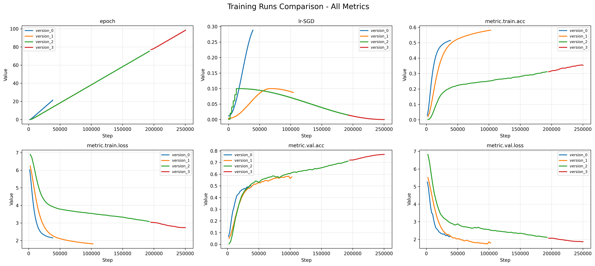

# ERA4 Mini Capstone

Train ResNet-50 on ImageNet-1K classification dataset.

## Results

Best results:
- validation accuracy: 77.2%
- number of epochs: 100

Training was interrupted since I was using a spot instance, but here are the training logs after interruption:
```
ubuntu@ip-172-31-34-127:~/Projects/era4-mini-capstone$ uv run scripts/main.py fit --config scripts/version_2.yaml --ckpt_path data/logs/resnet50_imagenet1k/version_2/checkpoints/last.ckpt
Seed set to 0
Using bfloat16 Automatic Mixed Precision (AMP)
GPU available: True (cuda), used: True
TPU available: False, using: 0 TPU cores
HPU available: False, using: 0 HPUs
/home/ubuntu/Projects/era4-mini-capstone/.venv/lib/python3.12/site-packages/torch/__init__.py:1551: UserWarning: Please use the new API settings to control TF32 behavior, such as torch.backends.cudnn.conv.fp32_precision = 'tf32' or torch.backends.cuda.matmul.fp32_precision = 'ieee'. Old settings, e.g, torch.backends.cuda.matmul.allow_tf32 = True, torch.backends.cudnn.allow_tf32 = True, allowTF32CuDNN() and allowTF32CuBLAS() will be deprecated after Pytorch 2.9. Please see https://pytorch.org/docs/main/notes/cuda.html#tensorfloat-32-tf32-on-ampere-and-later-devices (Triggered internally at /pytorch/aten/src/ATen/Context.cpp:80.)
  return _C._get_float32_matmul_precision()
You are using a CUDA device ('NVIDIA A10G') that has Tensor Cores. To properly utilize them, you should set `torch.set_float32_matmul_precision('medium' | 'high')` which will trade-off precision for performance. For more details, read https://pytorch.org/docs/stable/generated/torch.set_float32_matmul_precision.html#torch.set_float32_matmul_precision
Restoring states from the checkpoint path at data/logs/resnet50_imagenet1k/version_2/checkpoints/last.ckpt
/home/ubuntu/Projects/era4-mini-capstone/.venv/lib/python3.12/site-packages/lightning/pytorch/callbacks/model_checkpoint.py:445: The dirpath has changed from 'data/logs/resnet50_imagenet1k/version_2/checkpoints' to 'data/logs/resnet50_imagenet1k/version_3/checkpoints', therefore `best_model_score`, `kth_best_model_path`, `kth_value`, `last_model_path` and `best_k_models` won't be reloaded. Only `best_model_path` will be reloaded.
LOCAL_RANK: 0 - CUDA_VISIBLE_DEVICES: [0]
/home/ubuntu/Projects/era4-mini-capstone/.venv/lib/python3.12/site-packages/lightning/pytorch/utilities/model_summary/model_summary.py:231: Precision bf16-mixed is not supported by the model summary.  Estimated model size in MB will not be accurate. Using 32 bits instead.

  | Name      | Type               | Params | Mode 
---------------------------------------------------------
0 | model     | ResNet             | 25.6 M | train
1 | loss_fn   | CrossEntropyLoss   | 0      | train
2 | train_acc | MulticlassAccuracy | 0      | train
3 | val_acc   | MulticlassAccuracy | 0      | train
---------------------------------------------------------
25.6 M    Trainable params
0         Non-trainable params
25.6 M    Total params
102.228   Total estimated model params size (MB)
154       Modules in train mode
0         Modules in eval mode
Restored all states from the checkpoint at data/logs/resnet50_imagenet1k/version_2/checkpoints/last.ckpt
Training: |                                                                                                                                                                                                                                                          | 0/? [00:00<?, ?it/s]
Epoch 77: 100%|███████████████████████████████████████████████████████████████████████████████████████████████████████████████████████████████████████████████████| 5005/5005 [37:53<00:00,  2.20it/s, v_num=3, metric.val.loss=2.070, metric.val.acc=0.720, metric.train.loss=3.040, metric.train.acc=0.311]
Epoch 77, global step 195234: 'metric.val.acc' reached 0.72026 (best 0.72026), saving model to 'data/logs/resnet50_imagenet1k/version_3/checkpoints/resnet50-imagenet1k-epoch=77-metric.val.acc=0.7203.ckpt' as top 3                                                                                        
Epoch 78: 100%|███████████████████████████████████████████████████████████████████████████████████████████████████████████████████████████████████████████████████| 5005/5005 [37:33<00:00,  2.22it/s, v_num=3, metric.val.loss=2.030, metric.val.acc=0.723, metric.train.loss=3.020, metric.train.acc=0.319]
Epoch 78, global step 197737: 'metric.val.acc' reached 0.72346 (best 0.72346), saving model to 'data/logs/resnet50_imagenet1k/version_3/checkpoints/resnet50-imagenet1k-epoch=78-metric.val.acc=0.7235.ckpt' as top 3                                                                                        
Epoch 79: 100%|███████████████████████████████████████████████████████████████████████████████████████████████████████████████████████████████████████████████████| 5005/5005 [37:33<00:00,  2.22it/s, v_num=3, metric.val.loss=2.090, metric.val.acc=0.721, metric.train.loss=3.020, metric.train.acc=0.322]
Epoch 79, global step 200240: 'metric.val.acc' reached 0.72080 (best 0.72346), saving model to 'data/logs/resnet50_imagenet1k/version_3/checkpoints/resnet50-imagenet1k-epoch=79-metric.val.acc=0.7208.ckpt' as top 3                                                                                        
Epoch 80: 100%|███████████████████████████████████████████████████████████████████████████████████████████████████████████████████████████████████████████████████| 5005/5005 [37:33<00:00,  2.22it/s, v_num=3, metric.val.loss=2.040, metric.val.acc=0.731, metric.train.loss=3.000, metric.train.acc=0.324]
Epoch 80, global step 202743: 'metric.val.acc' reached 0.73078 (best 0.73078), saving model to 'data/logs/resnet50_imagenet1k/version_3/checkpoints/resnet50-imagenet1k-epoch=80-metric.val.acc=0.7308.ckpt' as top 3                                                                                        
Epoch 81: 100%|███████████████████████████████████████████████████████████████████████████████████████████████████████████████████████████████████████████████████| 5005/5005 [37:34<00:00,  2.22it/s, v_num=3, metric.val.loss=2.030, metric.val.acc=0.731, metric.train.loss=2.980, metric.train.acc=0.318]
Epoch 81, global step 205246: 'metric.val.acc' reached 0.73078 (best 0.73078), saving model to 'data/logs/resnet50_imagenet1k/version_3/checkpoints/resnet50-imagenet1k-epoch=81-metric.val.acc=0.7308.ckpt' as top 3                                                                                        
Epoch 82: 100%|███████████████████████████████████████████████████████████████████████████████████████████████████████████████████████████████████████████████████| 5005/5005 [37:33<00:00,  2.22it/s, v_num=3, metric.val.loss=2.000, metric.val.acc=0.736, metric.train.loss=2.950, metric.train.acc=0.329]
Epoch 82, global step 207749: 'metric.val.acc' reached 0.73644 (best 0.73644), saving model to 'data/logs/resnet50_imagenet1k/version_3/checkpoints/resnet50-imagenet1k-epoch=82-metric.val.acc=0.7364.ckpt' as top 3                                                                                        
Epoch 83: 100%|███████████████████████████████████████████████████████████████████████████████████████████████████████████████████████████████████████████████████| 5005/5005 [37:33<00:00,  2.22it/s, v_num=3, metric.val.loss=1.980, metric.val.acc=0.740, metric.train.loss=2.930, metric.train.acc=0.325]
Epoch 83, global step 210252: 'metric.val.acc' reached 0.73960 (best 0.73960), saving model to 'data/logs/resnet50_imagenet1k/version_3/checkpoints/resnet50-imagenet1k-epoch=83-metric.val.acc=0.7396.ckpt' as top 3                                                                                        
Epoch 84: 100%|███████████████████████████████████████████████████████████████████████████████████████████████████████████████████████████████████████████████████| 5005/5005 [37:35<00:00,  2.22it/s, v_num=3, metric.val.loss=1.970, metric.val.acc=0.743, metric.train.loss=2.880, metric.train.acc=0.337]
Epoch 84, global step 212755: 'metric.val.acc' reached 0.74312 (best 0.74312), saving model to 'data/logs/resnet50_imagenet1k/version_3/checkpoints/resnet50-imagenet1k-epoch=84-metric.val.acc=0.7431.ckpt' as top 3                                                                                        
Epoch 85: 100%|███████████████████████████████████████████████████████████████████████████████████████████████████████████████████████████████████████████████████| 5005/5005 [37:33<00:00,  2.22it/s, v_num=3, metric.val.loss=1.970, metric.val.acc=0.745, metric.train.loss=2.910, metric.train.acc=0.338]
Epoch 85, global step 215258: 'metric.val.acc' reached 0.74522 (best 0.74522), saving model to 'data/logs/resnet50_imagenet1k/version_3/checkpoints/resnet50-imagenet1k-epoch=85-metric.val.acc=0.7452.ckpt' as top 3                                                                                        
Epoch 86: 100%|███████████████████████████████████████████████████████████████████████████████████████████████████████████████████████████████████████████████████| 5005/5005 [37:33<00:00,  2.22it/s, v_num=3, metric.val.loss=1.970, metric.val.acc=0.748, metric.train.loss=2.870, metric.train.acc=0.339]
Epoch 86, global step 217761: 'metric.val.acc' reached 0.74830 (best 0.74830), saving model to 'data/logs/resnet50_imagenet1k/version_3/checkpoints/resnet50-imagenet1k-epoch=86-metric.val.acc=0.7483.ckpt' as top 3                                                                                        
Epoch 87: 100%|███████████████████████████████████████████████████████████████████████████████████████████████████████████████████████████████████████████████████| 5005/5005 [37:35<00:00,  2.22it/s, v_num=3, metric.val.loss=1.920, metric.val.acc=0.753, metric.train.loss=2.830, metric.train.acc=0.333]
Epoch 87, global step 220264: 'metric.val.acc' reached 0.75306 (best 0.75306), saving model to 'data/logs/resnet50_imagenet1k/version_3/checkpoints/resnet50-imagenet1k-epoch=87-metric.val.acc=0.7531.ckpt' as top 3                                                                                        
Epoch 88: 100%|███████████████████████████████████████████████████████████████████████████████████████████████████████████████████████████████████████████████████| 5005/5005 [37:34<00:00,  2.22it/s, v_num=3, metric.val.loss=1.930, metric.val.acc=0.754, metric.train.loss=2.810, metric.train.acc=0.338]
Epoch 88, global step 222767: 'metric.val.acc' reached 0.75368 (best 0.75368), saving model to 'data/logs/resnet50_imagenet1k/version_3/checkpoints/resnet50-imagenet1k-epoch=88-metric.val.acc=0.7537.ckpt' as top 3                                                                                        
Epoch 89: 100%|███████████████████████████████████████████████████████████████████████████████████████████████████████████████████████████████████████████████████| 5005/5005 [37:34<00:00,  2.22it/s, v_num=3, metric.val.loss=1.920, metric.val.acc=0.756, metric.train.loss=2.840, metric.train.acc=0.346]
Epoch 89, global step 225270: 'metric.val.acc' reached 0.75634 (best 0.75634), saving model to 'data/logs/resnet50_imagenet1k/version_3/checkpoints/resnet50-imagenet1k-epoch=89-metric.val.acc=0.7563.ckpt' as top 3                                                                                        
Epoch 90: 100%|███████████████████████████████████████████████████████████████████████████████████████████████████████████████████████████████████████████████████| 5005/5005 [37:34<00:00,  2.22it/s, v_num=3, metric.val.loss=1.900, metric.val.acc=0.758, metric.train.loss=2.780, metric.train.acc=0.342]
Epoch 90, global step 227773: 'metric.val.acc' reached 0.75792 (best 0.75792), saving model to 'data/logs/resnet50_imagenet1k/version_3/checkpoints/resnet50-imagenet1k-epoch=90-metric.val.acc=0.7579.ckpt' as top 3                                                                                        
Epoch 91: 100%|███████████████████████████████████████████████████████████████████████████████████████████████████████████████████████████████████████████████████| 5005/5005 [37:35<00:00,  2.22it/s, v_num=3, metric.val.loss=1.890, metric.val.acc=0.761, metric.train.loss=2.800, metric.train.acc=0.346]
Epoch 91, global step 230276: 'metric.val.acc' reached 0.76142 (best 0.76142), saving model to 'data/logs/resnet50_imagenet1k/version_3/checkpoints/resnet50-imagenet1k-epoch=91-metric.val.acc=0.7614.ckpt' as top 3                                                                                        
Epoch 92: 100%|███████████████████████████████████████████████████████████████████████████████████████████████████████████████████████████████████████████████████| 5005/5005 [37:35<00:00,  2.22it/s, v_num=3, metric.val.loss=1.890, metric.val.acc=0.764, metric.train.loss=2.790, metric.train.acc=0.351]
Epoch 92, global step 232779: 'metric.val.acc' reached 0.76414 (best 0.76414), saving model to 'data/logs/resnet50_imagenet1k/version_3/checkpoints/resnet50-imagenet1k-epoch=92-metric.val.acc=0.7641.ckpt' as top 3                                                                                        
Epoch 93: 100%|███████████████████████████████████████████████████████████████████████████████████████████████████████████████████████████████████████████████████| 5005/5005 [37:33<00:00,  2.22it/s, v_num=3, metric.val.loss=1.880, metric.val.acc=0.765, metric.train.loss=2.740, metric.train.acc=0.351]
Epoch 93, global step 235282: 'metric.val.acc' reached 0.76524 (best 0.76524), saving model to 'data/logs/resnet50_imagenet1k/version_3/checkpoints/resnet50-imagenet1k-epoch=93-metric.val.acc=0.7652.ckpt' as top 3                                                                                        
Epoch 94: 100%|███████████████████████████████████████████████████████████████████████████████████████████████████████████████████████████████████████████████████| 5005/5005 [37:33<00:00,  2.22it/s, v_num=3, metric.val.loss=1.870, metric.val.acc=0.767, metric.train.loss=2.740, metric.train.acc=0.347]
Epoch 94, global step 237785: 'metric.val.acc' reached 0.76690 (best 0.76690), saving model to 'data/logs/resnet50_imagenet1k/version_3/checkpoints/resnet50-imagenet1k-epoch=94-metric.val.acc=0.7669.ckpt' as top 3                                                                                        
Epoch 95: 100%|███████████████████████████████████████████████████████████████████████████████████████████████████████████████████████████████████████████████████| 5005/5005 [37:33<00:00,  2.22it/s, v_num=3, metric.val.loss=1.870, metric.val.acc=0.768, metric.train.loss=2.720, metric.train.acc=0.356]
Epoch 95, global step 240288: 'metric.val.acc' reached 0.76768 (best 0.76768), saving model to 'data/logs/resnet50_imagenet1k/version_3/checkpoints/resnet50-imagenet1k-epoch=95-metric.val.acc=0.7677.ckpt' as top 3                                                                                        
Epoch 96: 100%|███████████████████████████████████████████████████████████████████████████████████████████████████████████████████████████████████████████████████| 5005/5005 [37:34<00:00,  2.22it/s, v_num=3, metric.val.loss=1.890, metric.val.acc=0.768, metric.train.loss=2.730, metric.train.acc=0.356]
Epoch 96, global step 242791: 'metric.val.acc' reached 0.76826 (best 0.76826), saving model to 'data/logs/resnet50_imagenet1k/version_3/checkpoints/resnet50-imagenet1k-epoch=96-metric.val.acc=0.7683.ckpt' as top 3                                                                                        
Epoch 97: 100%|███████████████████████████████████████████████████████████████████████████████████████████████████████████████████████████████████████████████████| 5005/5005 [37:34<00:00,  2.22it/s, v_num=3, metric.val.loss=1.880, metric.val.acc=0.770, metric.train.loss=2.730, metric.train.acc=0.356]
Epoch 97, global step 245294: 'metric.val.acc' reached 0.76952 (best 0.76952), saving model to 'data/logs/resnet50_imagenet1k/version_3/checkpoints/resnet50-imagenet1k-epoch=97-metric.val.acc=0.7695.ckpt' as top 3                                                                                        
Epoch 98: 100%|███████████████████████████████████████████████████████████████████████████████████████████████████████████████████████████████████████████████████| 5005/5005 [37:33<00:00,  2.22it/s, v_num=3, metric.val.loss=1.850, metric.val.acc=0.769, metric.train.loss=2.730, metric.train.acc=0.359]
Epoch 98, global step 247797: 'metric.val.acc' reached 0.76942 (best 0.76952), saving model to 'data/logs/resnet50_imagenet1k/version_3/checkpoints/resnet50-imagenet1k-epoch=98-metric.val.acc=0.7694.ckpt' as top 3                                                                                        
Epoch 99: 100%|████████████████████████████████████████████████████████████████████████████████████████████████████████████████████████████████████████████████████████████████████████████████████████████████████████████████████████████████████████████████████████████████████████| 5005/5005 [37:34<00:00,  2.22it/s, v_num=3, metric.val.loss=1.860, metric.val.acc=0.770, metric.train.loss=2.730, metric.train.acc=0.351]
Epoch 99, global step 250300: 'metric.val.acc' reached 0.77022 (best 0.77022), saving model to 'data/logs/resnet50_imagenet1k/version_3/checkpoints/resnet50-imagenet1k-epoch=99-metric.val.acc=0.7702.ckpt' as top 3                                                                                                                                                                                                             
`Trainer.fit` stopped: `max_epochs=100` reached.
```

### Experiments

A total of 4 runs (3 with different config, the last one being a checkpoint resume) were performed. 



version_0 and version_1 both used OneCycleLR as the scheduler. The training seemed to stagnate at 50% and 60% validation accuracy (even the loss seemed to stagnate) respectively, so they were interrupted. Most likely the number of warm up epochs were too much.

version_2 (and version_3) both used the tried and tested consine annealing strategy for training ResNet-50, along with mixup. Although the training was slow (and training accuracy was most likely calculated incorrectly while logging) the model could train and reach upto 77.02% validation accuracy at the 100th epoch.

## Training

### Dataset Setup

Download and extract the ImageNet dataset from [Kaggle](https://www.kaggle.com/c/imagenet-object-localization-challenge/overview/description) into a directory. The path to the directory should be correctly mentioned in the training config file. An example config is defined [here](scripts/example_config.yaml).

To start training:
```bash
uv run scripts/main.py fit --config path/to/config.yaml
```

To resume from a checkpoint:
```bash
uv run scripts/main.py fit --config path/to/config.yaml --ckpt_path path/to/last.ckpt
```

### CLI Options

View all available options:
```bash
uv run scripts/main.py fit --help
```

Refer to [Lightning CLI documentation](https://lightning.ai/docs/pytorch/stable/cli/lightning_cli.html) for more details on configuration options.
